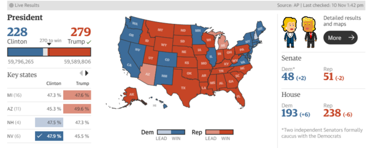

# Misleading Pre-election Poll
This is an [R Markdown](http://rmarkdown.rstudio.com) Notebook. When you execute code within the notebook, the results appear beneath the code. 

# 1. Introduction
The *American National Election Studies* (ANES) are surveys of eligible voters in the U.S. The ANEs conduct its two-wave pre and post study through face to face(FTF) and web interview. The data is collected and organized by Stanford University and the University of Michigan, with funding by the National Science Foundation. 

The data being used in this project are the *2016 Time Series Study* and *2012 Time Series Study*. This project will focus on the electoral participation, the effects of voting behaviors, gender, race on voting results.


The 2016 Presidential Election was really impressive to me for the reason that the Democracy candidate, Hillary Clinton, has so many titles as politician and as for the Republic candidate, Donald Trump, most known as a businessman, was a starter in politics. They are so different, and based on the pre-election survey, Hillary will get a straight win and add a new title - the first female president. However, things doesn't go as people expect. Afterwards, some people conclude that this survey bias is due to the unrepresentative sample, break of "Blue Wall", the decreased minor groups voters and rumor of Clinton and etc. In this project, we will decompose some of these reasons and see which leads to the failure of Hillary Clinton.

A rule of thumb for analyzing any data set is to understand its study design and data collection process first. You are strongly encouraged to read the *codebooks*. 

# 2. Data processing for this R Notebook.
### Step 2.1 Checking `R` packages for data processing

From the packages' descriptions:

+ `tidyverse` is an opinionated collection of R packages designed for data science. All packages share an underlying design philosophy, grammar, and data structures;
+ `haven` enables `R` to read and write various data formats used by other statistical packages. `haven` is part of the `tidyverse`.
+ `ggplot2` a collection of functions for creating graphics, based on The Grammar of Graphics.

```{r load libraries, warning=FALSE, message=FALSE, include=FALSE}

library(tidyverse)

library(haven)

library(ggplot2)
```

### Step 2.2 Import raw ANES data
We will be working with the DTA format of the raw ANES data, downloaded from [this page] (https://electionstudies.org/data-center/2016-time-series-study/) and [this page] (https://electionstudies.org/data-center/2012-time-series-study/)once you are registered *and* logged in you will see the download button. We will use the `read_dta` function from the `haven` package.
```{r, warning=FALSE, message=FALSE}
anes_timeseries_2016 <- read_dta("~/Documents/Github/Spring2021-Project1-TommyZzk/data/anes_timeseries_2016_dta/anes_timeseries_2016.dta")
```

### Step 3.3 Process variables for analysis
```{r, warning=FALSE, message=FALSE}
anes_timeseries_2012 <- read_dta("~/Documents/Github/Spring2021-Project1-TommyZzk/data/anes_timeseries_2012_dta/anes_timeseries_2012.dta")
```


In the following code chunk, we will create a few variables for this project. These variables were selected based on the setting of this project and their description in the ANES codebooks. You are encouraged to look them up and read about how they were prepared. The codebooks are located under the data file.

First let's look at our data. One advantage of using the DTA data is that the values are *labelled*. By converting labelled data to factor, you can easily reveal the responses encoded by numbers. We selected four variables for subsequent analysis and save the filtered data sets to the `output` folder. 

Most of the answers to the questionnaires are not within my interest, so we will do some basic data cleaning including convert data type and eliminating unused variables Then the updated datasets are saved in the Output file. 

First let's look at our data. One advantage of using the SPSS SAV data is that the values are *labelled*. By converting labelled data to factor, you can easily reveal the responses encoded by numbers. We selected seven variables from the anes_timeseries_2016 and three variables from anes_timeseries_2012 for subsequent analysis and save the filtered data sets to the `output` folder.

```{r, warning=FALSE, message=FALSE}
anes_use_2016 <- anes_timeseries_2016%>%
  dplyr::select(turnout = V162065x,
         vote = V161021a,
         old = V161006,
         race = V161310x,
         party = V162279,
         state = V163001a,
         win = V161148)%>%
  mutate(turnout = as_factor(turnout),
         vote = as_factor(vote),
         old = as_factor(old),
         race = as_factor(race),
         party = as_factor(party),
         state = as_factor(state),
         win = as_factor(win))
anes_use_2012 <- anes_timeseries_2012%>%
  dplyr::select(old_state = sample_state, old_race = dem_raceeth_x, old_vote = prevote_primvwho)%>%
  mutate(old_state = as_factor(old_state),
         old_race = as_factor(old_race),
         old_vote = as_factor(old_vote))
save(anes_use_2016,file="../output/data_use2016.RData")
save(anes_use_2012,file="../output/data_use2012.RData")
```

# 3. A simple analysis

## 3.1 How many people went to vote in the 2016 election?
First, let's see how people participate in the election. In 2016, there are `r nrow(anes_use_2016)` of effective participants in our sample (some people refuse to provide their answer, so they are eliminated from the dataset), and most of them are registered and voted. Therefore we can see that the overall participate rate is good.
```{r, warning=FALSE, message=FALSE, include=FALSE, include=TRUE}
anes_use_2016 = anes_use_2016%>%
  filter(turnout!="-2. Inap")
pie(table(anes_use_2016$turnout),main = "Vote",labels=c("","Did not register and \ndid not vote","Registered but did not vote","Registered and voted"))
```

## 3.2 How did different racial groups behave in the 2016 election?

Now, we would like to investigate whether different racial groups have different preference on the party selection.

```{r, warning=FALSE, message=FALSE, include=TRUE}
party_race_anes_2016 =anes_use_2016 %>%
  filter(race!="-2. Missing" & party!="-9. Refused" & party!="-7. No post data, deleted due to incomplete IW" & party!="-6. No post-election interview" & party!="-1. Inap")

ggplot(party_race_anes_2016)+
  geom_bar(aes(x=race, fill=party)) +
  theme(axis.text.x = element_text(angle = 45, hjust = 1))+
labs(title="Which party represents your views best?")+
scale_x_discrete(labels=c("1. White,non-Hispanic", "2. Black,non-Hispanic", "3. Asian,native Hawaiian or other Pacif Islr, \n non-Hispanic", "4. Native American or Alaska Native, \n non-Hispanic", "5. Hispanic", "6. Other non-Hispanic \n incl multiple races"))
```

We can see that among our interviewees, most of the supporters of Republican are White, non-Hispanic people, whereas the Democratic are boosted by the other racial groups. Therefore, the support of the Black people is crucial to Hillary Clinton. In this way, if she cannot get enough vote from them, it is reasonable that she would lost the combat. However, this is only a general survey about the support party, now let's see how do different racial groups really behave during the election.

```{r racial turnout analysis, fig.height=8, fig.width=10}
race_anes_2016 = anes_use_2016 %>%
  filter(race!="-2. Missing",!is.na(race) & !is.na(turnout))%>%
  group_by(race)%>%
  count(turnout)%>%
  mutate(prop=n/sum(n))

ggplot(race_anes_2016, 
       aes(x=turnout, y=prop)) +
  geom_bar(stat="identity", colour="black") + facet_wrap(~race,ncol=2) + theme_bw()+
  theme(axis.text.x = element_text(angle = 45,hjust = 1))+
labs(title="How did different racial groups participate in the election?")
```

Based on our sample data, we can see that among the black interviewees, about 80% of them went to vote. It seems that the Black people have a pretty good participation rate. So is it possible that voting behavior changes? For example, the Black people prefer Donald Trump to Hillary Clinton? 

```{r racial selection analysis, fig.height=8, fig.width=10}
president_race_anes_2016 <- anes_use_2016%>%
  filter(vote!="-1. Inap, 2,-8,-9 in V161021 " & vote!="-8. Don't know (FTF only)" & vote!="-9. Refused" & race!="-2. Missing" & vote == c("1. Hillary Clinton","4. Donald Trump") &race!="-2. Missing",!is.na(race) & !is.na(vote))%>%
  group_by(race)%>%
  count(vote)%>%
  mutate(prop=n/sum(n))

ggplot(president_race_anes_2016, 
       aes(x=vote, y=prop)) +
  geom_bar(stat="identity", colour="black") + facet_wrap(~race,ncol=2) + theme_bw()
```

The voting results meets our expectation. Donald Trump gets more White voter's support, and Hillary Clinton wins the other racial groups appreciation. Combining the information we obtained from the previous plot, we are going to conclude that neither the support of the Black, nor the voting behavior changes, and we should not consider the decreased Black voters as a leading factor to the failure of Hillary Clinton based on our data.

## 3.3 How did people's voting behavior changes in the Great Lake area?

The next guess for the loss is the break of the "Blue wall". First, let me explain what Blue Wall is. Blue is the represented color for Democratic Party, and the Blue Wall refers to the states around the Great Lakes who were the most loyalty Democrats since the Democratic Party always win this state and turn them blue.

So now let's compare the support that two parties get from these states during the 2012 election and 2016 election in our survey. 

```{r state vote analysis, fig.height=16, fig.width=5}
state_president_anes_2016 <- anes_use_2016%>%
  filter(vote!="-1. Inap, 2,-8,-9 in V161021 " & vote!="-8. Don't know (FTF only)" & vote!="-9. Refused"&  state == c("17. Illinois","18. Indiana","39. Ohio","26. Michigan","42. Pennsylvania","55. Wisconsin","27. Minnesota") & !is.na(state))%>%
  group_by(state)%>%
  count(vote)%>%
  mutate(prop=n/sum(n))
ggplot(state_president_anes_2016,aes(x=vote, y=prop))+
geom_bar(stat="identity", colour="black") + facet_wrap(~state, ncol = 1) + theme_bw()+
  theme(axis.text.x = element_text(angle = 45, hjust = 1))+
labs(title="Is the Blue Wall down?")

```

If we only consider the final president candidates - Hillary Clinton & Donald Trump, we can see that Clinton only has a slight lead over Trump. But if we compare party to party, we can see that these cities are mostly Democratics. 

```{r old state vote analysis, fig.height=16, fig.width=5}
state_president_anes_2012 <- anes_use_2012%>%
  filter(old_vote != "-1. Inapplicable",old_vote!=c("-8. Don't know","-9. Refused")& old_state==c("IL","IN","OH","MI","PA","WI","MN") & !is.na(old_state))%>%
  group_by(old_state)%>%
  count(old_vote)%>%
  mutate(prop=n/sum(n))
ggplot(state_president_anes_2012,aes(x=old_vote, y=prop))+
geom_bar(stat="identity", colour="black") + facet_wrap(~old_state, ncol = 1) + theme_bw()+
  theme(axis.text.x = element_text(angle = 45, hjust = 1))+
labs(title="Is the Blue Wall down?")
```

whereas in the previous election, we can see that Obama has control over the most of the states based on our data. Therefore, there is a possibility that although people still favor the Democrats, they are personally against Hillary Clinton due to her rumor. So, let's see how people vote differently from 2012-2016.

```{r, warning=FALSE, message=FALSE, include=TRUE}
old_president_anes_2016 <- anes_use_2016%>%
  filter(vote!="-1. Inap, 2,-8,-9 in V161021 " & vote!="-8. Don't know (FTF only)" & vote!="-9. Refused" & vote == c("1. Hillary Clinton","4. Donald Trump") & old!="-9. Refused"& old!="-8. Don’t know (FTF only)"&old!="-1. Inap, 2,-8,-9 in V161005 "&old!="6. Other specify - specified as: Did not vote/did not vote for President in 2012")

ggplot(old_president_anes_2016)+
geom_bar(aes(x=old, fill=vote))+
labs(title="Do you change your mind?")+
theme(axis.text.x = element_text(angle = 45, hjust = 1))+
scale_x_discrete(labels=c("1. Barack Obama","2. Mitt Romney","Other Specify","Did not vote"))
```

We can see that there are more people changing from voting for Democrats to Republic. So at some point, it is possible that some people vote for Donald Trump due to the scandal of Clinton.



# 4. Conclusion
Admittedly, some of the investigation of this project is not based on a fairly big enough sample space, and this EDA will have a better performance if we can have a larger dataset. However, the research result matches with the result done by some researchers and is therefore intuitive.

Based on the study, the failure of Hillary Clinton is not a result of the decreased number of Black votes. It is more like a result of her scandal and the politic policy. 


